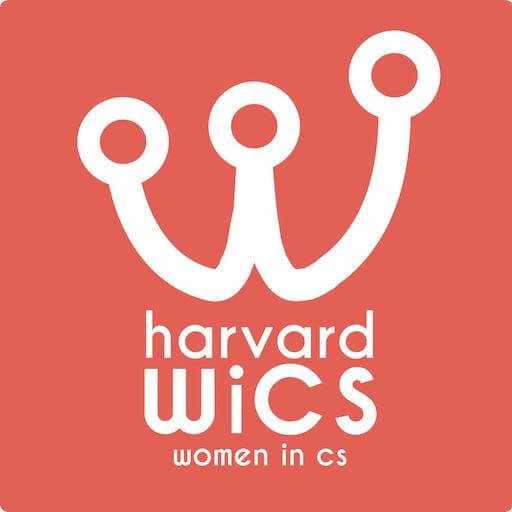

	
	 
	 
	

		<h1 align="center">WiCS Entrepreneurship Guide</h1>
		<a href="https://www.harvardwics.com">
			<b>Harvard Women in Computer Science</b>
		</a>
		 
		A work-in-progress collection of resources related to entrepreneurship in the Harvard community.
	

	 
	 
	 

## Table of Contents

* [Overview](#overview)
* [Joiners](#joiners)
* [Founders](#founders)
* [Licensing](#licensing)

## Overview

Entrepreneurship is a big world, and we know how hard it can be to see yourself pursuing it, especially when other careers, like finance, consulting, and software engineering have clear recruiting pipelines that start early in the semester and leave you with a decision before Christmas. That's why WiCS is trying to help you understand it with this Entrepreneurship Guide—hopefully we can clear some of the confusion away and give you answers about the stuff you-don't-know that you-don't-know.

First off, a brief overview of entrepreneurship at Harvard:

1. **There isn't a single, central community in which the best entrepreneurship is going on at Harvard.** Instead, it's diffuse across campus and clustered into friend groups. Institutional centers like the i-Lab or the on-campus clubs provide a lot of resources, but definitely aren't the end-all-be-all of the startup scene. Involving yourself with these communities is a great place to start though, and then asking people who they think you should chat with is a good way to branch out and start building an entrepreneurial community of your own.
2. **There's a lot of information assymetry in entrepreneurship, and much of the information is word-of-mouth or hidden in noise.** That's why it's important to meet with people working on entrepreneurship and involve yourself in the space when you can. The startup scene is a very heterogenous environment, with a wide range of experiences, but if you're committed it can be really rewarding and impactful.
3. **Many resources exist at Harvard, but you have to find out about and ask for them.** Related to the decentralization and heterogeneity, there isn't a clear path or checklist for how to take advantage of the entrepreneurial resources at Harvard. However, if you look for them and are brave enough to ask for them, there are more than you could take advantage of. Most of all, the alumni network is vast, valuable, and only an email or phone call away (as an easy way to get started, reach out to WiCS alum!).

The rest of this doc is broken into three large categories:

* **Miscellaneous or general items under the [Overview](#overview) section.** These apply to the entrepreneurial scene as a whole.
* **The [Joiners](#joiners) section is targetted at people who are interested in joining startups**, but aren't (yet) looking to found a company themselves. This section will attempt to clarify the process of finding, evaluating, and applying to startup companies. It won't make it as easy as the consulting/finance/big-tech recruiting processes, but it will try to make it a little more transparent.
* **The [Founders](#founders) section is targetted at folks who are looking to create new companies.** This section will be focused on resources available on campus and some guidance on being a student founder.

### Terminology

To help with understanding in the rest of the doc, here's some vocabulary that we'll be using and that comes up in the entrepreneurship space.

* **Founder** - Someone who creates a startup.
* **Joiner** - Someone who joins a startup after it's already been created.

*Another place to find terms related to entrepreneurship is [Gust's Startup Glossary](https://gust.com/launch/startup-glossary).*

### Organizations

There're are a ton of clubs and organizations at Harvard, so we wanted to surface the ones most focused on the entrepreneurial space.

* [Harvard Innovation Labs](https://innovationlabs.harvard.edu/) - Harvard's institutionally sponsored entrepreneurship community and collaborative space.
    * **Founders**: check out the [Venture Incubation Program (VIP)](https://innovationlabs.harvard.edu/venture-incubation-program/).
    * **Joiners**: visit the i-Lab to see job postings from startups in the VIP program.
* [Harvard Summer Camp](http://summercamp.io/) - Community of Harvard interns in the Bay Area and NYC who facilitate dinners, brunches, mixers and campus tours with leading technology companies.
* [Harvard College Ventures (HV)](https://www.harvardventures.org/) - The largest student-run entrepreneurship and venture capital organization at Harvard.
* [Harvard Undergraduate Capital Partners](https://www.harvardcap.org/) - Student-run consulting organization assisting venture capital clients with diligence and sourcing.

*Find more at [SEAS Student Organizations & Clubs](https://www.seas.harvard.edu/office-student-career-development/student-organizations-clubs).*

### Events

* [HackHarvard](https://hackharvard.io/) - A 36-hour hackathon hosted annually at Harvard in October.
* [MakeHarvard](https://www.makeharvard.io/) - A hardware focused hackathon hosted annually at Harvard in February.
* [HackMIT](https://hackmit.org/) - A hackathon hosted annually at MIT in September.
* [SheHacks Boston](https://boston.techtogether.io/shehacks/index.html) - A 36-hour, student-run hackathon open to all female and non-binary individuals hosted annually in the Boston area.

*Two great resources for finding hackathons are the [Major League Hackers](https://mlh.io/) list and the [Ladies Storm Hackathons FB Group](https://www.facebook.com/groups/LadiesStormHackathons/).*

### Classes

* [ES 95r: Startup R&D](http://tech.seas.harvard.edu/rad) - A unique educational experience that helps students act, think and feel like a startup founder by practicing, researching, and developing a new idea amidst peer and coach feedback. *Past companies like Mark43 and Plastiq have gone on to raise $10s millions in capital.*

### Fellowships

* [HBS Technology Innovation Fellowship](https://www.hbs.edu/mba/seas/Pages/default.aspx) - A joint HBS + SEAS program that lets 10-15 college students engage in HBS entrepreneurship classes and startup programming.

### Alumni Networks

* [Harvard Alumni in Tech](http://www.harvardintech.com/) - The official Harvard Alumni Group for technology. Currently active in New York City. *Join the mailing list to stay up-to-date about their activities.*
* [Harvard Alumni Entrepreneurs (HAE)](https://www.harvardae.org/) - Global network of leaders & innovators representing all Harvard schools which hosts events and networking directories. Currently active in most major cities.

## Joiners

* [AngelList](https://angel.co/jobs) - A free job board oriented at startups. *High volume, lower quality.*
* [Breakout List](https://breakoutlist.com/) - A VC curated job board for high growth, pre-IPO startups. *Low volume, higher quality.*
* [Rough Draft Ventures Academy](https://www.roughdraft.vc/academy) - RDV run program placing students into internships and full-time roles at startups in Boston and NYC.

## Founders

### Fundraising

#### Competitions

* [i3 Innovation Challenge](http://tech.seas.harvard.edu/harvardi3) - SEAS run competition for Harvard college startups with ~$5k / finalist in prize money.
* [President's Challenge](https://innovationlabs.harvard.edu/presidents-innovation-challenge/) - Harvard i-Lab run competition for Harvard startups with $75k grand prize and $25k runner-up prizes.
* [HBS New Venture Competition (HBS affiliate)](https://www.hbs.edu/newventurecompetition/Pages/default.aspx) - HBS run competition for startups with an HBS MBA founder, granting $75k grand prize and $25k runner-up prizes.

#### Angels

Angels are individuals who invest their personal capital into early stage companies. One way they can be different from venture capital (AKA institutional money) is that they might be more hands-on with the companies they invest in (e.g. they may have worked in the space), they may be less structured than VC, and they may be more willing to invest at very early stages. However, angels are harder to find then most VCs and don't always conform to VC investing norms.

Sometimes angels congregate into groups that host pitch events. There are several prominant groups in the Boston area:

* [HBS Alumni Angels Association](http://www.hbsalumniangels.com/) - Companies apply for funding via a local chapter, members screen 10-50 companies and invite 4-6 companies for each pitch event. Angels then make investment decisions independently.
* [MIT Alumni Angels of Boston](http://www.mitalumniangels.com/) - Similar to the HBS Alumni Angels, MIT Alumni Angels has ~200 Boston based investors.

#### Venture Capital

The following VCs have student representatives at Harvard. Both DRF and RDV's student reps are also partners with investment making ability. The other funds have separate partnerships that the student representatives help scout for.

* [Dorm Room Fund (DRF)](https://drf.vc/) - Student-run venture fund backed by First Round with partners in Boston, NYC, Philadelphia, and the Bay Area. Writes $20k checks to startups with student founders.
* [Rough Draft Ventures (RDV)](https://www.roughdraft.vc/) - Student-run venture fund backed by General Catalyst with partners in Boston, NYC, and the Bay Area. Writes $20k checks to startups with student founders.
* [Contrary Capital](https://contrarycap.com/) - Early stage venture fund based in SF and focused on student founded companies. Has partners at 100+ universities. Writes pre-seed checks ~$250k.
* [Romulus Capital](https://www.romuluscap.com/) - Early stage venture fund based in Cambridge and focused on B2B companies and spinouts from research groups. Writes Seed and Series A checks.
* [Underscore](https://underscore.vc) - Early stage venture fund based in Boston and focused on local companies.

### Free Services

* HLS
* iLab counsel
* AWS Startup / GCP Startup / Azure Startup (Usually tied to pre-seed funding)

### Accelerators

* Delta V (MIT affiliate)
* iLab VIP
* MassChallenge
* Y Combinator
* UFirst

## Womxn in Entrepreneurship

TODO - stats, content, specific advice. Also, intersperse quotes throughout the document.

TODO - add more articles/blogs/other reading material to help people grok the entrepreneurship scene writ large.

## Licensing

  
   
  CC0 — To the extent possible under law,
  <a rel="dct:publisher"
     href="https://www.harvardwics.com/">
    Harvard Women in Computer Science</a>
  has waived all copyright and related or neighboring rights to
  Entrepreneurship Guide.
This work is published from:

  United States.

